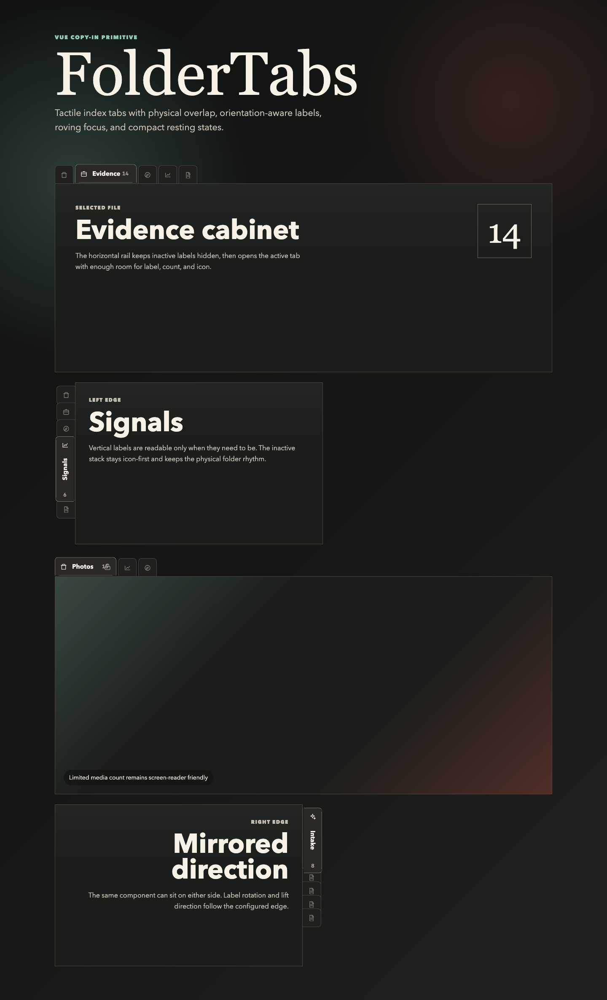

# FolderTabs

Tactile folder/index tabs for Vue. FolderTabs turns ordinary tablists into a
physical stack: icon-only at rest, label expansion on the active tab or
interaction, orientation-aware label rotation, optional overlap, and accessible
keyboard navigation.



This project started as a production component in Hammergebot, then became a
generic Vue primitive that can be installed as a package or copied into an app
in the spirit of shadcn-vue.

## Why This Exists

Most tab components are abstract strips. FolderTabs is meant for interfaces
where sections should feel like physical dividers: media galleries, document
review, research dossiers, audits, dashboards, notebooks, and anything that
benefits from a compact but memorable navigation object.

## Features

- Vue 3 component with `v-model`.
- Horizontal and vertical orientation.
- Edge-aware behavior: `top`, `bottom`, `left`, or `right`.
- Icon-only resting state with active, hover, or focus expansion.
- Density modes for physical overlap: `spread`, `overlap`, `dense`.
- Gravity classes for vertical expansion origin: `start`, `center`, `end`.
- Roving tab focus with automatic or manual activation.
- Full accessible labels can differ from compact visible labels.
- CSS variables for theming.
- No runtime dependencies beyond Vue.

## Install

The package is designed for npm publishing, but early adopters can copy the
source or install from GitHub once the repository is public.

```bash
pnpm add github:bdteo/folder-tabs
```

```ts
import { FolderTabs } from '@bdteo/folder-tabs';
import '@bdteo/folder-tabs/style.css';
```

## Copy-In Usage

For shadcn-style ownership, copy these files into your project:

```text
src/components/folder-tabs/FolderTabs.vue
src/components/folder-tabs/folderTabs.ts
src/components/folder-tabs/folder-tabs.css
src/components/folder-tabs/index.ts
```

The registry seed lives in `registry/vue/folder-tabs/`.

## Example

```vue
<script setup lang="ts">
import { ref } from 'vue';
import { FolderTabs, type FolderTabItem } from '@bdteo/folder-tabs';
import '@bdteo/folder-tabs/style.css';

const active = ref('photos');

const tabs: FolderTabItem[] = [
  { key: 'photos', label: 'Object photos', shortLabel: 'Photos', count: 15 },
  { key: 'plans', label: 'Floor plans', shortLabel: 'Plans', count: 2 },
  { key: 'maps', label: 'Maps and plans', shortLabel: 'Maps', count: 4 },
];
</script>

<template>
  <FolderTabs
    v-model="active"
    :tabs="tabs"
    aria-label="Media sections"
    orientation="horizontal"
    edge="top"
    expand-on="hover"
  />
</template>
```

## Props

| Prop | Type | Default | Notes |
| --- | --- | --- | --- |
| `tabs` | `FolderTabItem[]` | required | Each tab needs `key` and `label`. |
| `modelValue` | `string \| number \| null` | `null` | Active tab key. |
| `orientation` | `horizontal \| vertical` | `horizontal` | Changes layout and keyboard direction. |
| `edge` | `top \| right \| bottom \| left` | derived | Defaults to `top` for horizontal and `left` for vertical. |
| `density` | `spread \| overlap \| dense` | `spread` | Mainly useful for vertical stacks. |
| `activation` | `automatic \| manual` | `automatic` | Manual moves focus without changing the active tab. |
| `expandOn` | `active \| hover \| focus \| always` | `hover` | The active tab always expands. This controls extra expansion triggers. |
| `gravity` | `start \| center \| end` | `center` | Sets vertical transform origin. |
| `ariaLabel` | `string` | required | Label for the tablist. |
| `panelIdForTab` | `(tab) => string` | `null` | Optional `aria-controls` hook. |

## FolderTabItem

```ts
interface FolderTabItem {
  key: string | number;
  label: string;
  shortLabel?: string;
  srLabel?: string;
  icon?: Component | null;
  count?: string | number | null;
  countLabel?: string | number | null;
  totalCount?: string | number | null;
  disabled?: boolean;
  panelId?: string;
}
```

## Development

```bash
pnpm install
pnpm dev
pnpm test
pnpm build
pnpm build:demo
```

## License

MIT.
