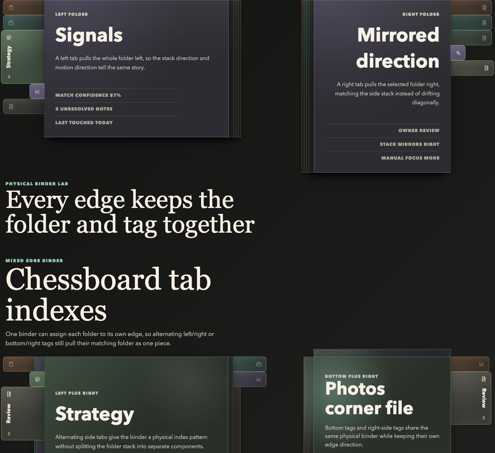
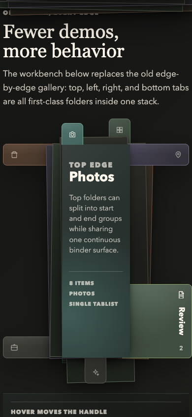

# FolderTabs

Tactile folder/index tabs for Vue. FolderTabs turns ordinary tablists into a
physical stack: icon-only at rest, label expansion on the active tab or
interaction, orientation-aware label rotation, optional overlap, and accessible
keyboard navigation.





This project started as a production component in Hammergebot, then became a
generic Vue primitive that can be installed as a package or copied into an app
in the spirit of shadcn-vue.

## Why This Exists

Most tab components are abstract strips. FolderTabs is meant for interfaces
where sections should feel like physical dividers: media galleries, document
review, research dossiers, audits, dashboards, notebooks, and anything that
benefits from a compact but memorable navigation object.

## Features

- Vue 3 component with `v-model`.
- Horizontal and vertical orientation.
- Edge-aware behavior: `top`, `bottom`, `left`, or `right`.
- Icon-only resting state with active, hover, or focus expansion.
- Density modes for physical overlap: `spread`, `overlap`, `dense`.
- Stack appearance for vertical, physical folder-divider layouts.
- `FolderAttachment` composition where every folder owns its tab handle and content surface as one physical piece.
- Tintable `Folder` surfaces, optional paper texture, and configurable `FolderBinder` depth/layers.
- Gravity classes for vertical expansion origin: `start`, `center`, `end`.
- Roving tab focus with automatic or manual activation.
- Full accessible labels can differ from compact visible labels.
- CSS variables for theming.
- No runtime dependencies beyond Vue.

## Install

The package is designed for npm publishing, but early adopters can copy the
source or install from GitHub once the repository is public.

```bash
pnpm add github:bdteo/folder-tabs
```

```ts
import { FolderTabs } from '@bdteo/folder-tabs';
import '@bdteo/folder-tabs/style.css';
```

Bundler-first apps can also import the source barrel when they want to own or
debug the Vue/CSS source directly. The source barrel imports the colocated CSS
file, so do not also import `@bdteo/folder-tabs/style.css` on this path. Its
published TypeScript surface still points at the generated package
declarations, so component prop types match the normal package entry:

```ts
import { FolderAttachment } from '@bdteo/folder-tabs/source';
```

## Copy-In Usage

For shadcn-style ownership, copy these files into your project:

```text
src/components/folder-tabs/FolderTabs.vue
src/components/folder-tabs/Folder.vue
src/components/folder-tabs/FolderAttachment.vue
src/components/folder-tabs/FolderBinder.vue
src/components/folder-tabs/FolderTabPanelStack.vue
src/components/folder-tabs/css.d.ts
src/components/folder-tabs/folderGeometry.ts
src/components/folder-tabs/folderTabs.ts
src/components/folder-tabs/folder-tabs.css
src/components/folder-tabs/index.ts
src/components/folder-tabs/useFolderPullMachine.ts
src/components/folder-tabs/useFolderTabList.ts
```

The registry seed lives in `registry/vue/folder-tabs/`.

When importing from the copied `index.ts` barrel, the copied
`folder-tabs.css` file is imported for you, and the copied `css.d.ts` shim keeps
that side-effect CSS import typed. Vue single-file-component typing should come
from the app's normal Vue/Vite setup. If you import individual `.vue` files
directly instead, import the copied CSS once from your app entry.

## Example

```vue
<script setup lang="ts">
import { ref } from 'vue';
import { FolderAttachment, type FolderTabItem } from '@bdteo/folder-tabs';
import '@bdteo/folder-tabs/style.css';

const active = ref('photos');

const tabs: FolderTabItem[] = [
  { key: 'photos', label: 'Object photos', shortLabel: 'Photos', tone: 'moss', count: 15 },
  { key: 'plans', label: 'Floor plans', shortLabel: 'Plans', tone: 'copper', count: 2 },
  { key: 'maps', label: 'Maps and plans', shortLabel: 'Maps', tone: 'violet', count: 4 },
];
</script>

<template>
  <FolderAttachment
    v-model="active"
    :tabs="tabs"
    ariaLabel="Media sections"
    orientation="horizontal"
    edge="top"
    expand-on="hover"
    depth="raised"
    tone="copper"
    :layers="2"
  >
    Active folder content goes here.
  </FolderAttachment>
</template>
```

## Props

Most navigation props are shared by `FolderTabs` and `FolderAttachment`.

| Prop | Type | Default | Notes |
| --- | --- | --- | --- |
| `tabs` | `FolderTabItem[]` | required | Each tab needs a unique `key` and `label`. Duplicate keys are ignored after the first match using the same string identity used for selection. |
| `modelValue` | `string \| number \| null` | `null` | Active tab key. Disabled, missing, or null keys fall back internally to the first enabled tab without emitting an update; if no tab is enabled, no tab is selected. |
| `orientation` | `horizontal \| vertical` | `horizontal` | Changes layout and keyboard direction. |
| `edge` | `top \| right \| bottom \| left` | derived | Defaults to `top` for horizontal and `left` for vertical. `FolderAttachment` also lets individual tabs override this with `tab.edge` for mixed-edge binders. |
| `density` | `spread \| overlap \| dense` | `spread` | Mainly useful for vertical stacks. |
| `activation` | `automatic \| manual` | `automatic` | Manual moves focus without changing the active tab. |
| `expandOn` | `active \| hover \| focus \| always` | `hover` | Controls tab label expansion triggers. Attached hover/focus tugs only the tab handle; clicking pulls the whole folder. Measured label slots expand only for the configured trigger or while pulled. |
| `gravity` | `start \| center \| end` | `center` | Sets vertical transform origin for the standalone rail. In `FolderAttachment`, `start` or `end` can also be used as the fallback slot group along each folder edge. |
| `appearance` | `rail \| stack` | `rail` | `stack` makes vertical tabs cascade like physical folder dividers. |
| `texture` | `none \| paper` | `none` | Adds a procedural, tileable paper grain to tab handles. `FolderAttachment` also applies it to the binder, folder sheets, and content surface. |
| `textureLayers` | `all \| shell \| sheet \| content \| tab \| none \| ('sheet' \| 'content' \| 'tab')[]` | `all` | Chooses which physical layers receive paper texture. `shell` means folder sheets plus tab handles, leaving slotted content clean. Standalone rails only paint the `tab` layer. |
| `textureBlendMode` | CSS blend mode \| `auto` | `auto` | Controls how the paper texture blends into the tab/folder surface. `auto` preserves the built-in paper recipe; explicit values include `normal`, `multiply`, `overlay`, `soft-light`, `hard-light`, `color-burn`, and other standard CSS blend modes. |
| `textColor` | `auto \| light \| dark \| inherit` | `auto` | Controls tab/folder ink color for labels, counts, icons, and slotted folder content. `auto` keeps light ink for darkening blend modes and switches to dark ink for brightening modes such as `screen`, `lighten`, and `color-dodge`. |
| `ariaLabel` | `string` | required | Label for the tablist. |
| `panelIdForTab` | `(tab) => string` | `null` | Optional `aria-controls` hook. External panel IDs are tried as `panelIdForTab(tab)` first, then `tab.panelId`; `FolderAttachment` generates panel IDs when external IDs are omitted, invalid, or duplicated, while standalone `FolderTabs` uses only valid, unique external panel IDs. |

Use `ariaLabel` in Vue templates. `aria-label` is treated by Vue's type
checker as a native ARIA attribute, not as this required component prop.

`FolderTabs` also accepts these standalone rail props:

| Prop | Type | Default | Notes |
| --- | --- | --- | --- |
| `activationMotionDuration` | `number` | `420` | Milliseconds that grabbed/receding tab classes stay active on the standalone tab rail. |
| `pulledKey` | `string \| number \| null` | `null` | Optional key that marks one standalone rail tab as physically pulled by an external panel. |

`FolderAttachment` also accepts these physical binder props:

| Prop | Type | Default | Notes |
| --- | --- | --- | --- |
| `depth` | `flat \| subtle \| raised \| deep` | `raised` | Controls binder/folder shadow depth. |
| `layers` | `number` | `2` | Bounded by `FolderBinder` to `0`, `1`, or `2` visible underlayers. |
| `tone` | `slate \| moss \| teal \| copper \| violet` | `slate` | Fallback tint for the binder and folders without their own `tone`. |
| `texture` | `none \| paper` | `none` | Adds a procedural, tileable paper grain to the binder, folder sheets, content surface, and attached tab handles without requiring an image asset. |
| `textureLayers` | `all \| shell \| sheet \| content \| tab \| none \| ('sheet' \| 'content' \| 'tab')[]` | `all` | Chooses where the paper layer is painted. Use `shell` for media galleries or app surfaces where the binder/tabs should feel like paper but the content area should stay owned by the app. |
| `textureBlendMode` | CSS blend mode \| `auto` | `auto` | Controls the paper overlay/background blending for the whole physical stack. |
| `textColor` | `auto \| light \| dark \| inherit` | `auto` | Controls the ink color for the whole physical stack. Use `dark` for known light paper themes and `light` for known dark themes. |
| `stackRotation` | `none \| folders \| pieces` | `none` | Controls optional tucked-stack rotation. `folders` rotates the background folder sheets; `pieces` rotates the whole folder piece. |
| `tabRotation` | `straight \| rotated` | `straight` | Controls whether inactive tab handles stay optically straight or rotate with the tucked folder sheet/piece. In `stackRotation="pieces"` straight handles counter-rotate so the page can tilt without tilting the handle. |
| `tuckedTilt` | `boolean` | `false` | Compatibility shortcut for `stackRotation="pieces"` when `stackRotation` is omitted. |
| `pullDistance` | `number` | `0` | Pixels the active folder moves outward while pulled. Increase it only when the content surface itself should visibly shift away from the binder. |
| `pullDuration` | `number` | `420` | Milliseconds before the newly selected folder settles from `pulling` into `pulled`. |
| `returnDuration` | `number` | `pullDuration * 0.75` | Milliseconds for the previous folder to fold back. Override when the return needs a different pace. |
| `folderClass` | `string` | `''` | Class added to the active folder content surface. |
| `emulatedHoverKey` | `string \| number \| null` | `null` | Visual QA hook; applies BEM hover-emulation classes with the same handle tug and slot geometry as real hover. |

## FolderAttachment

Use `FolderAttachment` when the tab and folder should behave like one physical object. It renders one `Folder` per tab inside a `FolderBinder`; each folder owns its own tab button, and the active folder owns the visible panel content. That means pull motion, z-index, edge direction, and tab placement are structurally connected instead of visually faked.

Its default slot receives `{ activeTab, activeIndex, pulled }`, its `icon` slot customizes attached tab icons, and `folderClass` is applied to the folder content surface. `FolderAttachment` generates stable, collision-resistant tab/panel IDs by default, gives every tab a real panel target with `aria-controls`, and wires each panel back with `aria-labelledby`; inactive panel shells stay hidden and empty while the active folder mounts the visible slot content. `panelIdForTab` or `tab.panelId` can override the generated panel ID. `pullDuration` controls how long the newly selected folder remains in the `pulling` phase before settling; `returnDuration` controls how long the previously pulled folder slides back, defaulting to 75% of `pullDuration` so folding feels slightly quicker than unfolding. `pullDistance` controls the actual outward offset; the default preserves z-index and stack-order behavior without moving the active content sheet, while positive values opt into visible sheet translation. The newly selected folder appears immediately in the pulled physical lane without an incoming transition while the previous folder folds back into its remembered tucked offset, avoiding a snap through a stale midpoint. Initial folders start tucked, including the first enabled folder that appears after an empty or all-disabled data load, and a clicked folder stays pulled until another folder is selected. Clicking the already-controlled active folder is idempotent, so it does not re-enter pull motion or nudge the tab out of alignment; fallback selections can still emit when `modelValue` is missing or disabled. The physical stack remembers selection history: the current folder is frontmost, recently selected folders sit higher in the tucked stack, and tuck depth follows the same recency order as z-index. Tucked folders remain visible as muted physical sheets, so the folder bodies/cards and their tag handles display the same remembered pile; even deeply tucked folders keep an icon-safe handle lane exposed so the icon stays fully visible and the tab remains easy to grab. `stackRotation` optionally gives those background sheets a small mirrored rotation, like folders pushed back into a real binder; `tabRotation` lets handles remain straight by default or rotate with the tucked sheet when that look is wanted. In `stackRotation="pieces"`, tab borders are suppressed so whole-page tilt reads as one continuous physical piece instead of a tab drawn on top of a page. Active and pulled folders stay square for readability. Inactive hover/focus now behaves like touching or listing through a real folder tab: only the handle tugs toward the tab edge while the folder sheet stays tucked. Measured slot expansion and neighbor displacement follow `expandOn`, so `expandOn="active"` keeps hover compact while `expandOn="hover"` opens the hovered tab. The selected folder immediately owns the higher layer and does not shift when its own tag is hovered. For visual QA, `emulatedHoverKey` applies `folder-attachment--hover-emulated`, `folder-attachment__folder--hover-emulated`, and `folder-attachment__tab--hover-emulated` while using the same handle tug and displacement geometry as a real hover.

For chessboard-style indexes, set `edge` on individual `FolderTabItem` objects. A single `FolderAttachment` can then mix compatible edges such as left/right or bottom/right; each folder still owns its tab and panel as one atomic piece, and the binder follows the active folder's edge.

For split lanes on the same physical edge, set `gravity` on individual `FolderTabItem` objects. For example, top-edge tabs can have a `start` group on the left and an `end` group on the right while still pulling upward from the same folder edge.

## Folder and FolderBinder

Use `Folder` for the active content surface and `FolderBinder` for the physical holder/stack around it. A binder is the thing that holds folders together; the component uses that metaphor so `FolderAttachment` can pull folders out in the configured edge direction while the binder owns the shared depth, tint, edge, and layer direction.

| Prop | Type | Default | Notes |
| --- | --- | --- | --- |
| `orientation` | `horizontal \| vertical` | `horizontal` | Used only to derive the default edge. |
| `edge` | `top \| right \| bottom \| left` | derived | Direction the folder tabs attach to. Binder layers recede away from this edge; `FolderAttachment` applies active folder pull motion. |
| `depth` | `flat \| subtle \| raised \| deep` | `raised` | Controls the strength of panel shadow/layering. |
| `layers` | `number` | `2` | Bounded to `0`, `1`, or `2` visible underlayers. |
| `activeIndex` | `number` | `0` | Exposed as a CSS variable for app-specific position-dependent styling. |
| `tone` | `slate \| moss \| teal \| copper \| violet` | `slate` | Tints the folder and binder layers. |
| `texture` | `none \| paper` | `none` | Adds the same procedural paper grain used by `FolderAttachment` to standalone binder/folder compositions. |
| `textureLayers` | `all \| shell \| sheet \| content \| tab \| none \| ('sheet' \| 'content' \| 'tab')[]` | `all` | Chooses where the paper layer is painted. `FolderBinder` and standalone `Folder` primarily use `sheet`; compatibility wrappers also forward the setting to their child pieces. |
| `textureBlendMode` | CSS blend mode \| `auto` | `auto` | Controls how that paper grain blends into standalone binder/folder surfaces. |
| `textColor` | `auto \| light \| dark \| inherit` | `auto` | Controls standalone binder/folder ink color. |
| `pulled` | `boolean` | `false` | Raises the binder/front layer for a pulled stack. It does not apply the outward pull transform by itself; `FolderAttachment` owns the tab-and-folder pull motion. |

`Folder` accepts `tone` so the content surface matches its binder. `FolderAttachment` also accepts `tone` as a fallback, while each `FolderTabItem` can set its own `tone` to make individual folders in a stack visually distinct. `texture="paper"` works out of the box with a CSS-generated fiber grain, and the package also ships a small set of image-backed paper presets for stronger material texture. Use `textureLayers` when the app surface and the physical shell need different material treatment: `all` preserves the full paper recipe, `shell` paints only the sheets and handles, `content` paints only the active content surface, and arrays such as `['sheet', 'tab']` are accepted for explicit control. This is especially useful for photo galleries, maps, and document previews where the content should not inherit the binder grain. Use `textureBlendMode` when the same texture should sink into the surface differently, for example `multiply` for darker paper bite or `soft-light` for a gentler cardstock feel. `textColor="auto"` uses a CSS heuristic: darkening modes keep light ink, while brightening modes use dark ink. When an app knows its surface is light or dark, `textColor="dark"` or `textColor="light"` is the explicit override. `FolderTabPanelStack` remains available as a compatibility wrapper around `FolderBinder` + `Folder`.

Image-backed paper textures are first-class package assets. Import a preset style
and bind it to the same element that receives `texture="paper"`:

```vue
<script setup lang="ts">
import {
  FolderAttachment,
  getFolderPaperTextureStyle,
  type FolderTabItem,
} from '@bdteo/folder-tabs';
import '@bdteo/folder-tabs/style.css';

const tabs: FolderTabItem[] = [
  { key: 'intake', label: 'Client intake' },
  { key: 'review', label: 'Review notes' },
];

const paperStyle = getFolderPaperTextureStyle('paper05HybridStrong');
</script>

<template>
  <FolderAttachment
    :tabs="tabs"
    ariaLabel="Paper folders"
    texture="paper"
    textureLayers="shell"
    textureBlendMode="color-burn"
    :style="paperStyle"
  >
    Folder content
  </FolderAttachment>
</template>
```

Available preset keys are `watercolor`, `paper03HybridStrong`,
`paper03HybridStrongRepeat`, `paper05HybridStrong`, and
`paper05HybridStrongRepeat`. The exported `folderPaperTexturePresets` and
`folderPaperTexturePresetOptions` objects expose the underlying URL, filter,
opacity, and sizing values when an app wants to build its own selector.

## Geometry Helpers

The package exports the finite geometry helpers used by the physical stack. Use these when app-specific styling, overlays, or custom demos need to stay aligned with the built-in pull mechanics.

```ts
import {
  getFolderEdgeVector,
  getFolderHoverOffset,
  getFolderMinimumGrabSize,
  getFolderMinimumVisibleGrabSize,
  getFolderPieceTuckOffset,
  getFolderPullOffset,
  getFolderStackSlots,
  getFolderTabReachSize,
  getFolderTuckRotation,
  getFolderVisibleGrabSize,
  type FolderTabMeasurement,
} from '@bdteo/folder-tabs';
```

| Helper | Use |
| --- | --- |
| `getFolderEdgeVector(edge)` | Canonical axis/sign for `top`, `right`, `bottom`, and `left`. |
| `getFolderPieceTuckOffset(edge, index, activeIndex, density)` | Resting offset for tucked folder sheets. |
| `getFolderTuckRotation(edge, index, activeIndex)` | Small mirrored rotation for optional tucked-folder tilt. |
| `getFolderPullOffset(edge, distance?)` | Outward click/pull offset for the selected folder; defaults to `0` so active sheets stay flush unless a distance is provided. |
| `getFolderHoverOffset(edge)` | Small handle-only hover/focus tug. |
| `getFolderStackSlots(options)` | Measured tab slot positions, including expanded tabs and density overlap. |
| `getFolderTabReachSize(...)` | Tab handle reach needed after tuck depth and panel cover are accounted for. |
| `getFolderVisibleGrabSize(...)` | Remaining visible/clickable handle lane after occlusion. |
| `getFolderMinimumGrabSize(...)` and `getFolderMinimumVisibleGrabSize(edge)` | Minimum grab-lane sizing; side edges reserve a larger icon-safe lane that also drives the side reveal gutter. |

All geometry helpers normalize invalid runtime numbers into finite non-negative values before returning CSS-friendly measurements.

## Accessibility and Motion

Both components render ARIA tablists with roving focus, disabled-tab skipping, automatic or manual activation, and stable generated tab/panel IDs where panels are owned by the component. `FolderAttachment` always renders the tab and panel shell inside the same `Folder`, so the DOM follows the physical model as well as the visuals.

Motion durations are normalized to finite non-negative milliseconds. The stylesheet also honors `prefers-reduced-motion: reduce` by disabling rail, folder, binder, layer, and attached-tab transitions and animations while preserving the final layout state.

## FolderTabItem

```ts
interface FolderTabItem {
  key: string | number;
  label: string;
  shortLabel?: string;
  srLabel?: string;
  edge?: 'top' | 'right' | 'bottom' | 'left'; // Optional per-folder edge override for FolderAttachment.
  gravity?: 'start' | 'center' | 'end'; // Optional per-folder slot group on its edge for FolderAttachment.
  tone?: FolderTone;
  icon?: Component | null;
  count?: string | number | null;
  countLabel?: string | number | null; // Optional visible/accessibility count override, even without count.
  totalCount?: string | number | null;
  disabled?: boolean;
  panelId?: string; // Optional panel id override used for aria-controls.
}
```

## Development

```bash
pnpm install
pnpm dev
pnpm screenshots
pnpm verify
pnpm test
pnpm build
pnpm build:demo
pnpm verify:demo
pnpm verify:screenshots
pnpm verify:package
```

The local demo accepts QA URL params for stable visual states: `activeTop`,
`activeLeft`, `activeBottom`, `activeRight`, `activeChess`, and `activeCorner`
set the initially selected folder, while `hoverTop`, `hoverLeft`,
`hoverBottom`, `hoverRight`, `hoverChess`, and `hoverCorner` emulate hover.
Use `texture=fiber`, `texture=watercolor`, `texture=paper03HybridStrong`,
`texture=paper03HybridStrongRepeat`, `texture=paper05HybridStrong`, or
`texture=paper05HybridStrongRepeat` to open the demo directly in one of the
paper surface modes. Add `blend=multiply`, `blend=overlay`, `blend=soft-light`,
`blend=color-burn`, or another supported blend value to compare texture
compositing. Add `textureLayers=shell`, `textureLayers=content`, or
`textureLayers=tab` to compare which physical paper layers are painted. Add
`text=dark`, `text=light`, or `text=auto` to compare ink color behavior.

`pnpm screenshots` refreshes the overview and attached-stack PNGs in
`docs/screenshots/` from the real Vite demo using a temporary Chrome DevTools
session. It defaults to Google Chrome on macOS; set `CHROME_PATH` to another
Chromium executable, or set `FOLDERTABS_SCREENSHOT_PORT` /
`FOLDERTABS_CHROME_PORT` if the default local ports are busy.

`pnpm verify:screenshots` captures the same demo screenshots into a temporary
folder and compares them with `docs/screenshots/` without mutating the working
tree. Set `FOLDERTABS_SCREENSHOT_CHECK_PORT` /
`FOLDERTABS_SCREENSHOT_CHECK_CHROME_PORT` if the default freshness-check ports
are busy.

`pnpm verify:demo` opens the real demo in temporary headless Chrome viewports
and asserts the browser-rendered physical contracts that are easy to miss in
unit tests: the demo console stays free of page errors, inactive side folders
keep an icon-safe grab lane exposed, buried side icons remain visibly topmost,
active tabs stay attached to their panels, hovered handles tug without pulling
their folder sheet, hovered folders do not overtake the selected folder, and
real demo tab clicks immediately front and pull the selected folder. Set
`FOLDERTABS_DEMO_QA_PORT` /
`FOLDERTABS_DEMO_QA_CHROME_PORT` if the default QA ports are busy.

`pnpm verify:package` builds and packs the library, then compiles throwaway
consumers for the published package entry, the `./source` entry, and the
registry copy-in files.

`pnpm verify` is the full local gate. It checks source/registry sync, runs
tests and typecheck, verifies browser-rendered demo geometry, verifies
screenshot freshness, verifies package and registry consumers, builds the demo,
runs `git diff --check`, and confirms the temporary demo browser sessions did
not leave stale headless Chrome processes behind.

## License

MIT.
